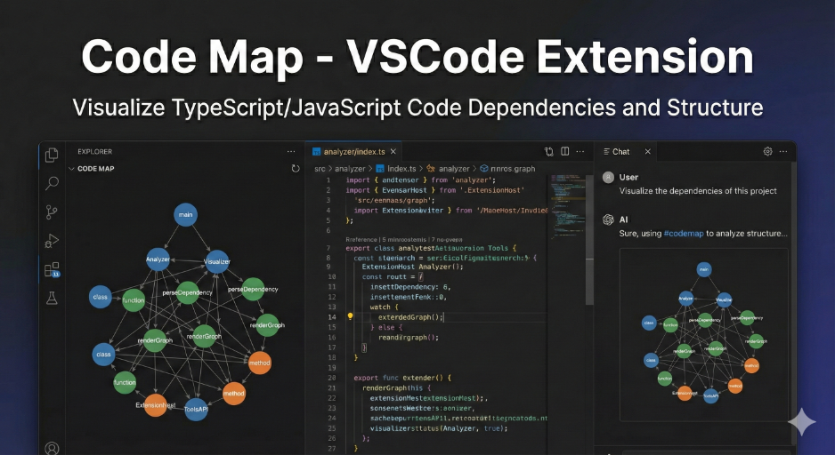

# LLM Code Map - VSCode Extension



A VSCode extension that graphically visualizes code dependencies and structure for TypeScript/JavaScript.

## Features

- Analyzes dependencies at function, class, and method levels
- Interactive graph visualization using D3.js
- Fixed display in the sidebar
- Language Model Tool API support (can be automatically invoked from AI agents)

## Trying Locally

### Method 1: Development Mode (Recommended)

This is the easiest method during development.

1. **Install Dependencies**

```bash
npm install
```

2. **Compile TypeScript**

```bash
npm run compile
```

3. **Launch Extension Development Host**

- Open this project in VSCode
- Press `F5`, or
- Select "Run Extension" in the Debug panel (`Cmd+Shift+D`) and run it

4. **A New VSCode Window Opens**

- This window is the Extension Development Host
- The extension runs in this window

5. **Use the Extension**

- The "LLM Code Map" view appears in the Explorer sidebar
- Click the refresh button to run code analysis

### Method 2: Create and Install .vsix File

Use this method if you want to try it in a production-like environment.

1. **Install vsce (First Time Only)**

```bash
npm install -g @vscode/vsce
```

2. **Create .vsix File**

```bash
vsce package
```

This creates a `codemap-0.0.1.vsix` file.

3. **Install in VSCode**

- Press `Cmd+Shift+P` (Mac) or `Ctrl+Shift+P` (Windows/Linux) in VSCode
- Select "Extensions: Install from VSIX..."
- Select the created `.vsix` file

4. **Enable the Extension**

- Find "LLM Code Map" in the Extensions panel and enable it
- Reload VSCode

## Usage

### Manually Generate LLM Code Map

1. Open the "LLM Code Map" view in the sidebar
2. Click the refresh button (🔄)
3. The graph will be displayed

### Use from AI Agent

Instruct in chat as follows:

- "Visualize the dependencies of this project"
- "Display the code structure using #codemap"

## Development

### File Structure

```
codemap/
├── src/
│   ├── extension.ts              # Entry point
│   ├── analyzer/                  # Code analysis
│   ├── visualizer/               # Graph visualization
│   ├── tools/                    # Language Model Tool
│   └── utils/                    # Utilities
├── media/                        # Webview resources (HTML/CSS/JS)
└── out/                          # Compiled files
```

### Commands

- `npm run compile` - Compile TypeScript
- `npm run watch` - Compile in watch mode
- `npm run lint` - Run linter

## Troubleshooting

### Extension Not Displayed

- Reload VSCode (`Cmd+R` or `Ctrl+R`)
- Check the Explorer sidebar
- Check for errors in the debug console

### Graph Not Displayed

- Verify that a workspace is open
- Verify that TypeScript/JavaScript files exist
- Click the refresh button

## License

MIT
